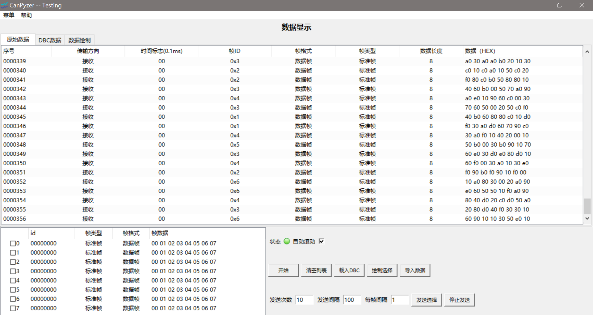
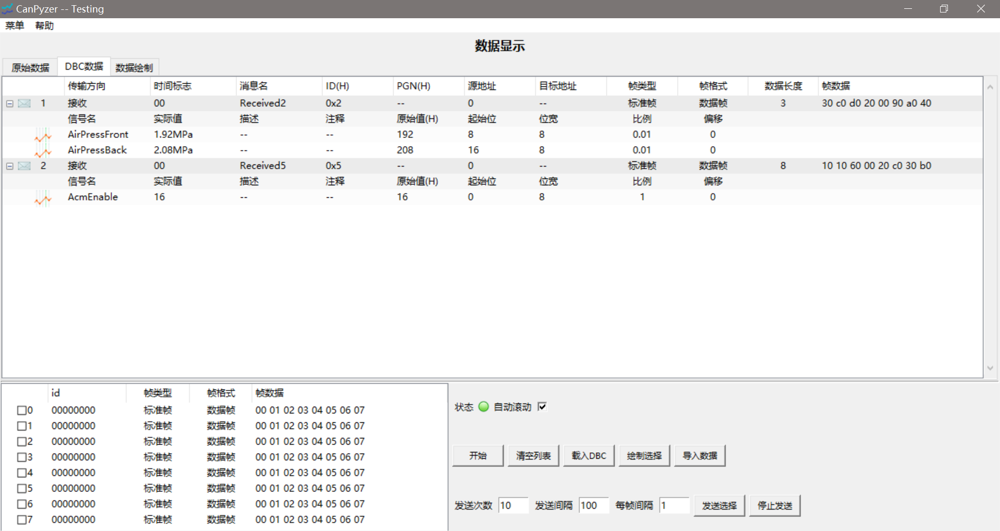
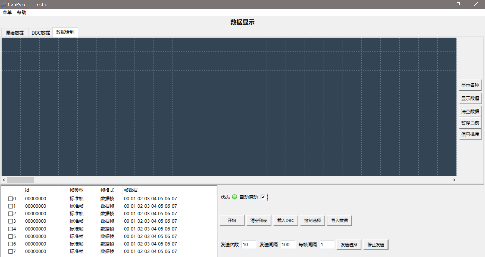
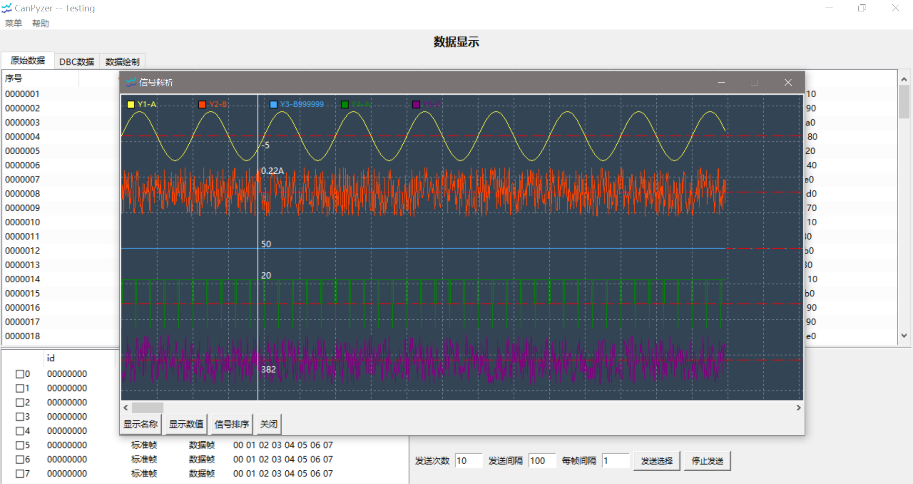

## CAN分析工具
    环境：windows & python3 
    设备：周立功USBCAN-I（可在源码中修改支持更多设备）
- 多种周立功CAN设备
- 发送数据
- 导入DBC文件
- 数据保存（csv）
- 数据可视化 [模块](https://github.com/hehenihao/pySnippets/tree/master/04_canvasPlot)

### Screenshoots
- 主界面

- DBC数据解析

- 实时数据绘制

*由于该功能暂时存在bug，截图尚无数据绘制*
- 导入数据分析

### TODOs
- 选取信号的实时绘制存在bug，界面卡顿，数据显示存在问题，待优化；
- 绘图模块增加双游标功能，方便数据分析。

##### Tips
- 由于``tkinter``的表格组件无直接编辑功能，某些需要编辑数据的表格采用双击弹框的方式进行。
- 程序``enbaleOfflineTest``变量用于没有连接CAN设备情况下，自动生成测试数据，生成数据与测试用dbc中报文id数据配套（启动后本次无法暂停，程序标题会增加Testing字样，测试用dbc位于data目录）。